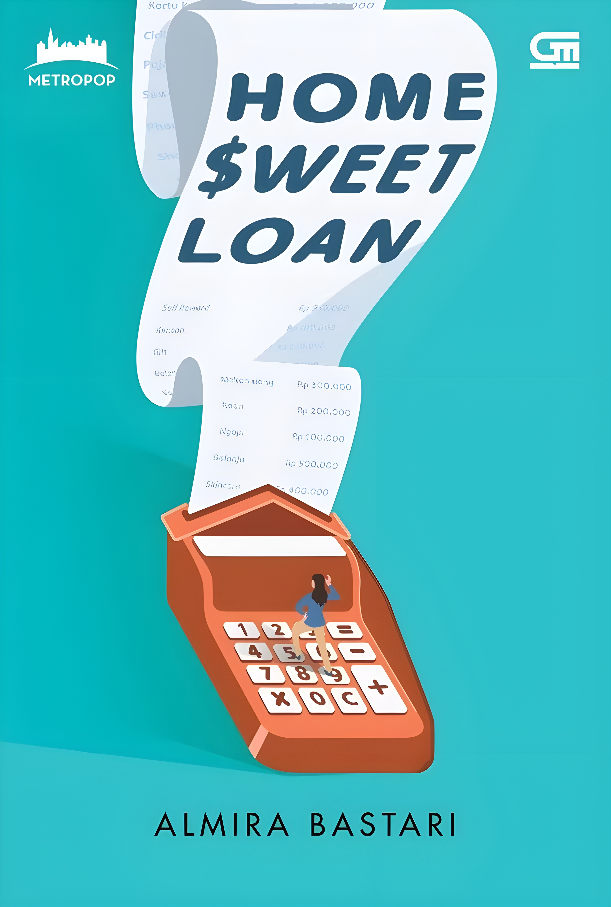

<!DOCTYPE html>
<html lang="id">

<head>
    <meta charset="UTF-8">
    <meta name="viewport" content="width=device-width, initial-scale=1.0">
    <title>Review Buku Modern</title>
    <link href="https://fonts.googleapis.com/css2?family=Poppins:wght@300;400;600&display=swap" rel="stylesheet">
    
</head>

<body>
    
    <!-- Navbar -->
    <nav>
        
Riutrive

        <ul>
            <li><a href="#home">Home</a></li>
            <li><a href="#buku">Buku</a></li>
            <li><a href="#kontak">Kontak</a></li>
        </ul>
        

            <i class="fas fa-moon"></i>
        

    </nav>

    <!-- Header -->
    <header id="home">
        <h1>Selamat Datang di Riutrive</h1>
        
Temukan ulasan buku terbaik dan menarik untuk inspirasi membaca Anda dari unitrive!

    </header>
    

    <!-- Search Bar -->
    

        <input type="text" id="searchBar" placeholder="Cari berdasarkan judul, penulis, atau deskripsi...">
        <button onclick="searchBooks()">Cari</button>
    

   

    

        <!-- Card 1 -->
        

            
                

                <h2>Selamat Tinggal</h2>
                
<strong>Penulis:</strong> Tere Liye

                
Buku ini bercerita tentang Sintong Tinggal, mahasiswa yang lulus setelah 6 tahun dengan skripsi
                    tentang Sutan Pane. Ia bekerja paruh waktu di toko buku bajakan dan menyadari dampaknya terhadap
                    penulis. Pertemuannya dengan Jess dan Bunga, mahasiswa fakultas ekonomi, di toko buku bajakan
                    membuka jalan bagi hubungan dan konflik yang menarik.

                <a href="halaman selanjutnya.html">
                    <label for="tombol">Selengkapnya</label></a>
                

                    ⭐⭐⭐⭐(4.5/5)
                

            

        

        <!-- Card 2 -->
        

            
                

                <h2>Laut Bercerita</h2>
                
<strong>Penulis:</strong> Leila S. Chudori

                
Laut Bercerita, novel dari Leila S. Chudori, bertutur tentang kisah keluarga yang kehilangan,
                    sekumpulan sahabat yang merasakan kekosongan di dada, sekelompok orang yang gemar menyiksa dan
                    lancar berkhianat, sejumlah keluarga yang mencari kejelasan makam anaknya, dan tentang cinta yang
                    tak akan luntur.

                <a href="Hal 2 Laut Bercerita.html">
                    <label for="tombol">Selengkapnya</label></a>
                

                    ⭐⭐⭐⭐⭐(5/5)
                

            

        

        <!-- Card 3 -->
        

            
            

                <h2>Home Sweet Loan</h2>
                
<strong>Penulis:</strong> Christian Simamora

                
 Home Sweet Loan adalah novel karya Christian Simamora yang menceritakan perjuangan seorang wanita muda bernama Jasmine dalam menghadapi realitas pahit kehidupan urban.
                    Jasmine, seorang pekerja kantoran, terjebak dalam dilema besar: mengejar impiannya memiliki rumah sendiri di Jakarta atau terus berkutat dengan gaya hidup konsumtif yang tidak ada habisnya.
                

                <a href="Hal 2 Home Sweet Loan.html">
                    <label for="tombol">Selengkapnya</label></a>
                

                    ⭐⭐⭐⭐(4.2/5)
                

            

        

        <!-- Card 4 -->
        

            
                

                <h2>Hello Cello</h2>
                
<strong>Penulis:</strong> Nadia Ristivani

                
Novel ini menggambarkan perjalanan Cello dalam mencari makna hidup, menghadapi trauma masa lalu, serta hubungannya dengan orang-orang di sekitarnya, termasuk keluarga dan teman-temannya.
                

                
                
                
                <a href="halaman selanjutnya.html">
                <label for="tombol">Selengkapnya</label></a>
                
                
                    

                   ⭐⭐⭐⭐(4.4/5)
                

            
            

        

        <!-- Card 5 -->
        

            
                

                <h2>Hello Cello Again</h2>
                
<strong>Penulis:</strong> Tere Liye

                
Buku ini bercerita tentang Sintong Tinggal, mahasiswa yang lulus setelah 6 tahun dengan skripsi
                    tentang Sutan Pane. Ia bekerja paruh waktu di toko buku bajakan dan menyadari dampaknya terhadap
                    penulis. Pertemuannya dengan Jess dan Bunga, mahasiswa fakultas ekonomi, di toko buku bajakan
                    membuka jalan bagi hubungan dan konflik yang menarik.

                <a href="halaman selanjutnya.html">
                    <label for="tombol">Selengkapnya</label></a>
                

                    ⭐⭐⭐⭐(4.5/5)
                

            

        

        <!-- Card 6 -->
        

            
                

                <h2>Azzamine</h2>
                
<strong>Penulis:</strong> Shopie Aulia

                
Buku ini bercerita tentang Sintong Tinggal, mahasiswa yang lulus setelah 6 tahun dengan skripsi
                    tentang Sutan Pane. Ia bekerja paruh waktu di toko buku bajakan dan menyadari dampaknya terhadap
                    penulis. Pertemuannya dengan Jess dan Bunga, mahasiswa fakultas ekonomi, di toko buku bajakan
                    membuka jalan bagi hubungan dan konflik yang menarik.

                <a href="halaman selanjutnya.html">
                    <label for="tombol">Selengkapnya</label></a>
                

                    ⭐⭐⭐⭐(4.5/5)
                

            

        

        <!-- Card 7 -->
        

            
                

                <h2>Teluk Alaska</h2>
                
<strong>Penulis:</strong> Shopie Aulia

                
Buku ini bercerita tentang Sintong Tinggal, mahasiswa yang lulus setelah 6 tahun dengan skripsi
                    tentang Sutan Pane. Ia bekerja paruh waktu di toko buku bajakan dan menyadari dampaknya terhadap
                    penulis. Pertemuannya dengan Jess dan Bunga, mahasiswa fakultas ekonomi, di toko buku bajakan
                    membuka jalan bagi hubungan dan konflik yang menarik.

                <a href="halaman selanjutnya.html">
                    <label for="tombol">Selengkapnya</label></a>
                

                    ⭐⭐⭐⭐(4.5/5)
                

            

        

    

    

    
</body>
    <footer>
        
&copy; 2024 Review Buku Modern. Dibuat dengan semangat membaca.

    </footer>
</body>

</html>

</html>
